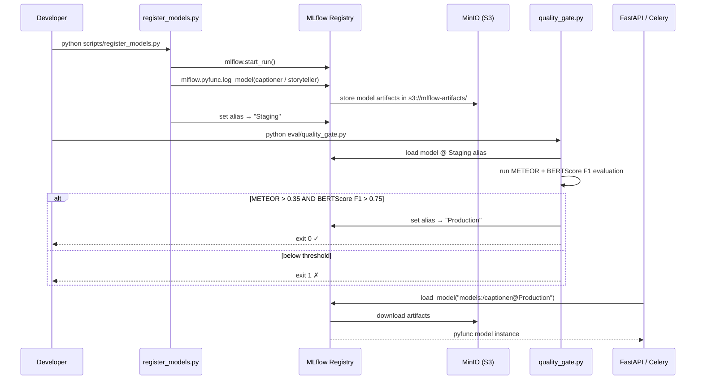
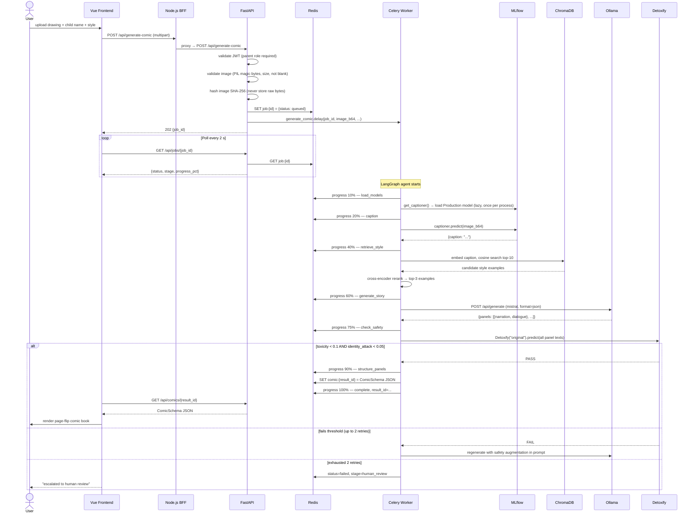
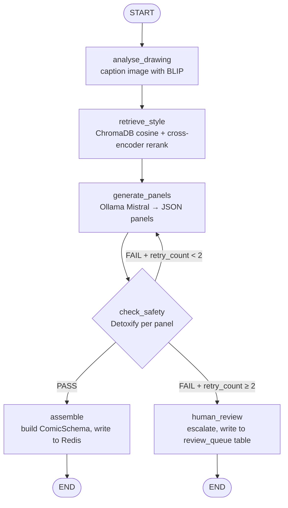
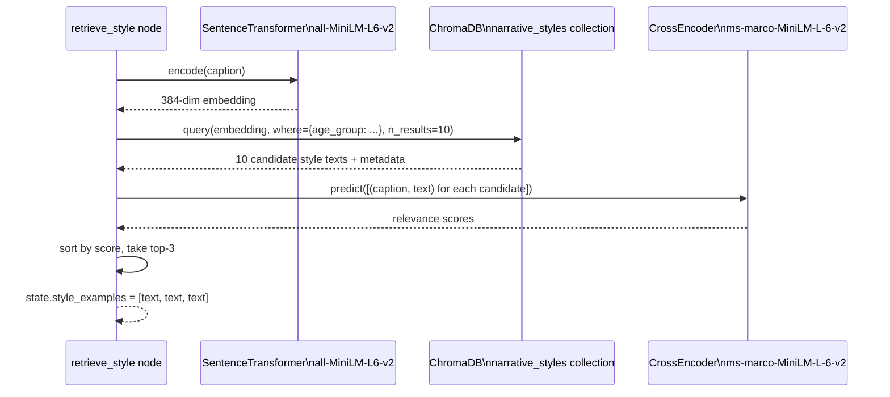
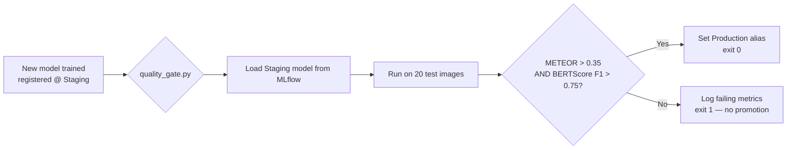

# Sketch to Story — Architecture & How It Works

## What the system does

A child uploads a drawing. The platform turns it into a personalised 4-panel comic book:
caption the drawing → retrieve style examples → write the story → check safety → render the comic.

---

## Services at a glance

| Service | Role | Port |
|---|---|---|
| **Vue 3 Frontend** | Upload form, comic reader, library | 5173 |
| **Node.js BFF** | Proxy + HTML export | 3001 |
| **FastAPI** | REST API, job enqueueing, auth | 8000 |
| **Celery Worker** | Runs the LangGraph agent pipeline | — |
| **Redis** | Celery broker + job/comic state store | 6379 |
| **MLflow** | Model registry + experiment tracking | 5001 |
| **MinIO** | Artifact storage for MLflow | 9000/9001 |
| **PostgreSQL** | MLflow backend + audit log | 5432 |
| **Ollama** | Runs Mistral LLM on the host | 11434 |
| **ChromaDB** | Vector store for style library (RAG) | — (in-process) |

---

## The two registered models

### 1. Captioner — `salesforce/blip-image-captioning-base`

Wrapped in `backend/models/captioner.py` as an `mlflow.pyfunc.PythonModel`.

| | |
|---|---|
| **Input** | `pd.DataFrame` with column `image_bytes` (base64 string) |
| **Output** | `{"caption": str, "latency_ms": float}` |
| **Inference** | BLIP `BlipProcessor` + `BlipForConditionalGeneration`, up to 50 new tokens |
| **Device** | MPS on Apple Silicon, CPU elsewhere |
| **Dev stub** | Returns `"A child's colorful drawing showing a cheerful scene..."` |

### 2. Storyteller — `mistral` via Ollama

Wrapped in `backend/models/storyteller.py` as an `mlflow.pyfunc.PythonModel`.

| | |
|---|---|
| **Input** | `pd.DataFrame` with `caption`, `style_examples` (JSON), `panel_count` |
| **Output** | `{"panels": [{"panel": int, "narration": str, "dialogue": str\|null}]}` |
| **Inference** | HTTP POST to `http://host.docker.internal:11434/api/chat` (Ollama REST) |
| **Dev stub** | Returns 4 pre-written mock panels without calling Ollama |

Both models are registered in MLflow under the **`Production`** alias. The app only ever loads the `Production` alias — it never picks up a `Staging` model at runtime.

---

## How MLflow is used



**Key MLflow concepts used:**

- **Run**: every `register_models.py` call starts a run, logs params (`model_type`, `stub`), and logs the model artifact.
- **Registered model**: named `captioner` and `storyteller` in the registry.
- **Alias**: `Staging` → under evaluation; `Production` → what the app serves. The quality gate promotes Staging → Production.
- **`mlflow.pyfunc.load_model("models:/captioner@Production")`**: the lazy-loading singleton in `model_loader.py` calls this on first use in each process.

---

## End-to-end comic generation



---

## LangGraph agent topology



---

## RAG pipeline (retrieve_style node)



The style library lives in `backend/rag/style_library.json` — 30+ narrative style examples tagged with `style`, `age_group`, and `tone`. Build the index once with `make rag-index`.

---

## Model promotion quality gate



The CI workflow (`.github/workflows/model-ci.yml`) runs this gate automatically on every push to a phase branch. Only models that pass can receive the `Production` alias.

---

## Data privacy rules (enforced in code)

| Rule | Where enforced |
|---|---|
| Raw image bytes never written to disk or DB | `main.py` hashes on arrival; `tasks.py` passes only base64 over Celery |
| Only SHA-256 hashes in audit log | `_audit_job()` in `tasks.py`, `human_review` node |
| Safety gate on every panel | `check_safety` node — toxicity < 0.1, identity_attack < 0.05 |
| JWT required for every generation request | `require_role("parent")` on `POST /api/generate-comic` |
| Governance gate before Production promotion | `gate_runner.py` must exit 0 |

---

## Developer quick-start

```bash
# 1. Start everything
make up

# 2. Register stub models (no real weights needed)
make seed

# 3. Build the RAG index (once)
make rag-index

# 4. Open the UI
open http://localhost:5173
```

To use real models, pull Mistral and register the real wrappers:

```bash
ollama pull mistral
cd backend && python scripts/register_models.py
python eval/quality_gate.py   # promotes to Production if metrics pass
```
