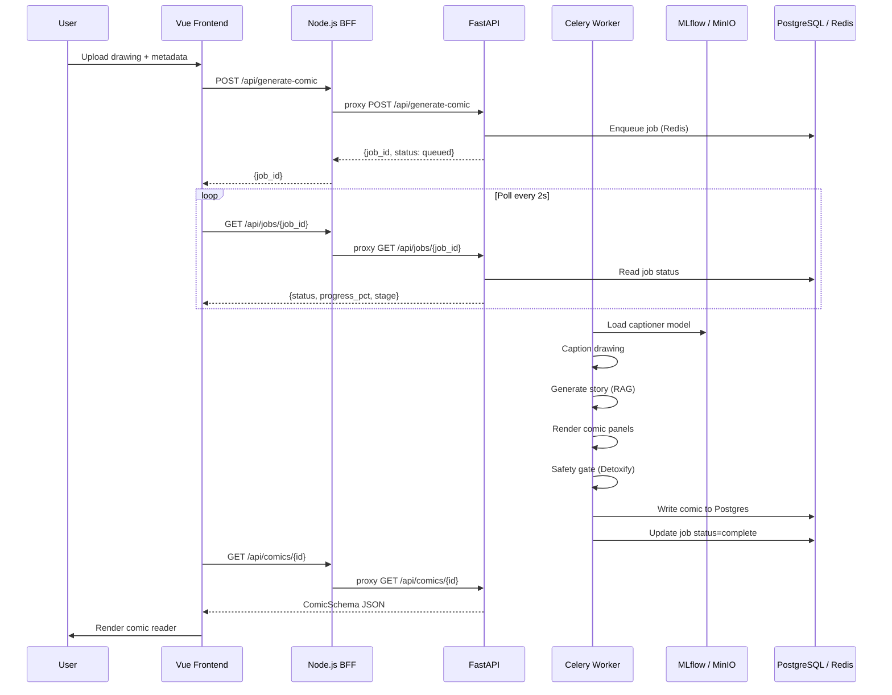

# Architecture Overview

The Sketch to Story platform follows a microservices architecture with a clear separation between the frontend, BFF, API, and ML infrastructure layers.

## Request Flow

## Component Responsibilities

| Component | Responsibility |
|-----------|---------------|
| **Vue Frontend** | Comic reader (StPageFlip), generation wizard, library view |
| **Node.js BFF** | CORS, proxy to FastAPI, HTML export, static file serving |
| **FastAPI** | REST API, job enqueueing, auth (JWT), audit logging |
| **Celery** | Async task execution: caption → story → render → safety |
| **MLflow** | Model registry, experiment tracking, pyfunc serving |
| **MinIO** | Artefact storage for model weights and generated assets |
| **ChromaDB** | Vector store for RAG style library |
| **Redis** | Job queue (Celery broker) and result backend |
| **PostgreSQL** | Comic storage, audit log, job metadata |
| **Prometheus + Grafana** | Metrics collection and alerting |
