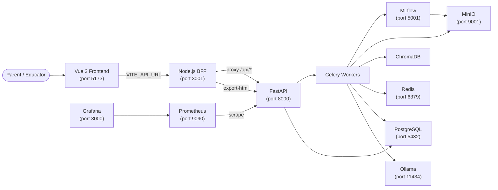

# Sketch to Story

**Sketch to Story** is a local AI platform that transforms children's drawings into personalised, illustrated comic books. A child's sketch becomes a full narrative with AI-generated captions, an age-appropriate story, and a rendered comic with speech bubbles and narration.

## What it does

1. A parent or educator uploads a photo of a child's drawing.
2. The platform identifies the content of the drawing (BLIP-2 captioner).
3. A RAG-augmented story-generation pipeline produces a short, age-appropriate story in the requested style.
4. The story is rendered into a comic layout with panels, speech bubbles, and narration.
5. Every output passes a safety gate (Detoxify) before reaching the client.
6. The comic is viewable in a page-flip browser reader and downloadable as a self-contained HTML file.

## System Architecture



## Phase Overview

| Phase | Focus | Status |
|-------|-------|--------|
| 1 | MLOps Foundation — MLflow, MinIO, pyfunc wrappers, CI/CD | Complete |
| 2 | Model Serving API — FastAPI, Celery, Docker, k3s, Helm | Complete |
| 3 | RAG & Agentic Pipeline — ChromaDB, LangChain, LangGraph | Complete |
| 4 | Monitoring & Drift — Prometheus, Evidently, Grafana | Complete |
| 5 | Governance & Safety — Detoxify, JWT RBAC, audit log | Complete |
| 6 | Frontend & Docs — Vue 3, Node.js BFF, MkDocs | Complete |

## Quick Start

```bash
# 1. Start infrastructure
docker compose up -d

# 2. Start FastAPI + Celery
cd backend
uvicorn app.main:app --reload --port 8000 &
celery -A app.tasks worker --loglevel=info &

# 3. Start BFF
cd bff && npm install && npm run dev &

# 4. Start Vue frontend
cd frontend && npm install && npm run dev
```

Open [http://localhost:5173](http://localhost:5173) to access the comic library.

## Critical Constraints

!!! warning "Child Data Privacy"
    Raw image bytes are **never** persisted to disk or database.
    Only SHA-256 hashes appear in the audit log.

!!! danger "Safety Gate"
    Every generated story panel must pass Detoxify thresholds:
    `toxicity < 0.1` and `identity_attack < 0.05`.

!!! info "EU AI Act"
    This system is classified **Limited Risk** with additional transparency
    obligations due to processing children's data. See the
    [AI Act Classification](governance/ai-act-classification.md) page.
